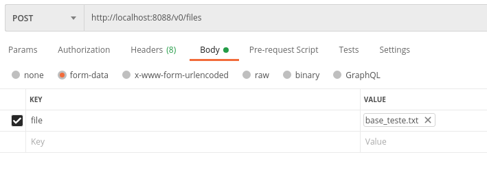
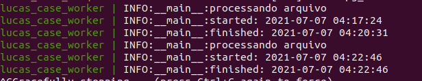

# Case Neoway

## Preparação

### buildar projeto: `docker-compose build`

### subir aplicação + banco + worker: `docker-compose up`
```
A aplicação estará escutando na porta 8088.
O banco postgres estará utilizando a porta 5432.
```

### criar tabelas: `docker exec lucas_case_app alembic upgrade head`

## Testando

- Realizar uma requisição `POST` do tipo form-data para http://localhost:8088 anexando o arquivo base_test.txt 
  na chave `file`

  
- Os logs deverão aparecer na saída do docker-compose:

  

## Obs
- Os arquivos anexados ficarão na tabela `files`
- Os dados extraídos se encontram na tabela `clients`
- Os processamentos com erro, na tabela `error_logs`
